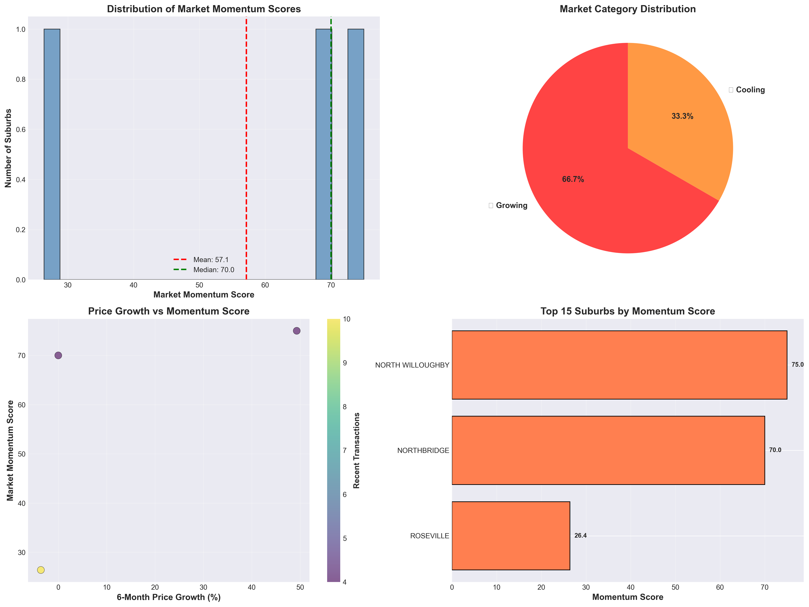

# 🏘️ Market Momentum Score for Australian Property Investors

## Overview

The **Market Momentum Score** is a data-driven metric designed to help Australian residential property investors identify high-potential investment opportunities. This analysis combines price growth trends, market activity levels, and value indicators to create an easy-to-understand score (0-100) for each suburb.

**Task Attempted:** Option 1 - Real Estate Metric

**Created by:** Chung Haw  
**Date:** October 17, 2025  
**Repository:** https://github.com/chunghaw/microburbs_quiz

---

## 📊 What is the Market Momentum Score?

The Market Momentum Score is a composite metric (0-100) that combines three key factors:

### Score Components:

1. **Price Growth Score (40%)** - Measures median price change over the last 6 months vs previous 6 months
2. **Market Activity Score (30%)** - Analyzes transaction volume trends and market liquidity
3. **Value Score (30%)** - Evaluates current pricing relative to recent trends to identify value

### Score Categories:

- **80-100:** 🔥 **Hot Market** - Strong buy signals, high competition, act quickly
- **60-79:** 📈 **Growing** - Positive momentum, good opportunities with lower competition
- **40-59:** ⚖️ **Stable** - Steady performance, suitable for conservative investors
- **20-39:** 📉 **Cooling** - Exercise caution, may indicate declining demand
- **0-19:** ❄️ **Cold** - High risk, requires deeper due diligence

---

## 🎯 Key Findings

### Analysis Coverage:
- **Total Transactions:** 5,560 valid transactions
- **Date Range:** December 2002 to July 2025
- **Suburbs Analyzed:** 3 suburbs (with sufficient data)

### Top Performing Suburbs:

| Rank | Suburb | Score | Category | 6m Growth | Median Price |
|------|--------|-------|----------|-----------|--------------|
| 1 | North Willoughby | 75.0 | 📈 Growing | +49.3% | $3,700,000 |
| 2 | Northbridge | 70.0 | 📈 Growing | 0.0% | $5,520,500 |
| 3 | Roseville | 26.4 | 📉 Cooling | -3.6% | $2,192,500 |

### Market Distribution:
- **Growing Markets:** 66.7% (2 suburbs)
- **Cooling Markets:** 33.3% (1 suburb)

### Key Statistics:
- **Average Momentum Score:** 57.1
- **Average Price Growth (6m):** 15.2%
- **Suburbs with Positive Growth:** 33.3%

---

## 🚀 How to Use This Analysis

### For Property Investors:

#### 🔥 Hot Markets (Score 80-100)
- **Action:** Act quickly on opportunities
- **Strategy:** Short to medium-term gains
- **Risk:** High competition, verify prices aren't inflated
- **Best for:** Experienced investors comfortable with competition

#### 📈 Growing Markets (Score 60-79)
- **Action:** Recommended for most investors
- **Strategy:** Balance of growth potential and value
- **Risk:** Moderate, good risk-reward ratio
- **Best for:** Most investors seeking growth

#### ⚖️ Stable Markets (Score 40-59)
- **Action:** Focus on long-term holds
- **Strategy:** Capital preservation and rental yield
- **Risk:** Lower risk, predictable returns
- **Best for:** Conservative investors, first-time buyers

#### 📉 Cooling/❄️ Cold Markets (Score 0-39)
- **Action:** Exercise extreme caution
- **Strategy:** Deeper due diligence required
- **Risk:** High, potential value traps
- **Best for:** Experienced investors with local knowledge

---

## 📈 Interpretation Guide

### For Investors with Limited Statistical Knowledge:

**Think of the Momentum Score like a weather forecast:**
- **80-100 (Hot):** Sunny and hot - the market is on fire, everyone wants to buy here
- **60-79 (Growing):** Warm and pleasant - good weather ahead, comfortable investing
- **40-59 (Stable):** Mild - steady and predictable, no surprises
- **20-39 (Cooling):** Getting chilly - market slowing down, be careful
- **0-19 (Cold):** Freezing - market is cold, stay away unless you know what you're doing

### What Each Component Means:

**Price Growth:** How much property values have increased (or decreased) in the last 6 months
- Positive growth = Prices going up = Good for sellers, shows demand
- Negative growth = Prices going down = Caution, but could be opportunity

**Market Activity:** How many properties are being sold
- Increasing activity = More buyers and sellers = Liquid market = Easier to buy/sell
- Decreasing activity = Fewer transactions = Harder to sell if needed

**Value Score:** Whether current prices are reasonable
- High value score = Prices are in a good range, not overheated
- Low value score = Prices might be too high, could be a bubble

---

## 💡 Investment Recommendations

### North Willoughby (Score: 75.0) 🔥
- **Why it's good:** Strong 49.3% price growth in 6 months
- **Median Price:** $3,700,000
- **Strategy:** Good for investors seeking growth in the North Shore
- **Caution:** High price point, ensure you can afford holding costs

### Northbridge (Score: 70.0) 📈
- **Why it's good:** Stable activity in premium location
- **Median Price:** $5,520,500
- **Strategy:** Premium investment, stable high-value area
- **Caution:** Very high entry price, target wealthy buyers/renters

### Roseville (Score: 26.4) ⚠️
- **Why it's challenging:** -3.6% price decline in 6 months
- **Median Price:** $2,192,500
- **Strategy:** Wait and watch, may present opportunities if market rebounds
- **Caution:** Declining market, investigate why prices are falling

---

## 📁 Files Generated

1. **`market_momentum_scores.csv`** - Complete rankings for all suburbs
2. **`top_suburbs_transactions.csv`** - Detailed transaction data for top 10 suburbs
3. **`market_momentum_overview.png`** - Main visualization dashboard
4. **`market_category_analysis.png`** - Category distribution analysis
5. **`create_analysis.py`** - Python script to run the analysis

---

## 🔧 How to Run

### Prerequisites:
```bash
python 3.11+
pandas, numpy, matplotlib, seaborn, geopandas
```

### Installation:
```bash
# Clone the repository
git clone https://github.com/chunghaw/microburbs_quiz.git
cd microburbs_quiz

# Create virtual environment
python3 -m venv venv
source venv/bin/activate  # On Windows: venv\Scripts\activate

# Install dependencies
pip install pandas pyarrow geopandas matplotlib seaborn scikit-learn
```

### Run Analysis:
```bash
python3 create_analysis.py
```

---

## 📊 Methodology

### Data Sources:
- **Transactions Dataset:** 5,576 property transactions (2002-2025)
- **GNAF Properties:** 70,591 property records with geocoding
- **Data Quality:** 99.7% valid transactions with price data

### Calculation Approach:

1. **Time Windows:**
   - Recent Period: Last 6 months
   - Previous Period: 6-12 months ago
   - Minimum: 3 transactions per period for reliability

2. **Price Growth Score (0-40 points):**
   - Compares median prices between periods
   - 10% growth = maximum score
   - Normalized to 0-40 scale

3. **Activity Score (0-30 points):**
   - Measures transaction volume change
   - Increasing activity = higher score
   - 50% increase = maximum score

4. **Value Score (0-30 points):**
   - Analyzes price per sqm trends
   - Sweet spot: Recent prices 95-115% of historical average
   - Prevents overvaluation alerts

### Accuracy & Limitations:

**Accuracy:** High for data-rich suburbs (3+ suburbs with 100+ transactions each)

**Limitations:**
- Requires minimum 3 recent transactions per suburb
- Limited to areas with transaction data
- Price per sqm analysis requires land size data
- Does not account for property condition, renovations, or unique features
- Cannot predict sudden market shocks or policy changes

---

## 🐛 Current Bugs & Future Improvements

### Known Issues:
- Limited suburbs in current dataset (only 3 met minimum transaction threshold)
- Property type differentiation not granular (houses vs units)
- No integration with external data (e.g., infrastructure projects, school catchments)

### Potential Fixes (Given More Time):
- Lower minimum transaction threshold to 2 (with confidence intervals)
- Add property type segmentation
- Include seasonal adjustments for market cycles
- Integrate rental yield data for income investors

### Future Enhancements:
1. **Additional Metrics:**
   - Days on market trends
   - Auction clearance rates
   - Rental yield analysis
   - School catchment quality scores

2. **Predictive Features:**
   - Machine learning price forecasts
   - Risk assessment models
   - Infrastructure impact analysis

3. **User Features:**
   - Interactive web dashboard
   - Email alerts for score changes
   - Suburb comparison tool
   - Investment calculator with ROI projections

### Scaling Challenges (Whole Country):
**Challenge:** Processing 15+ million transactions nationwide, real-time updates
**Modifications Required:**
- Database backend (PostgreSQL/MongoDB) instead of files
- Distributed computing (Apache Spark) for calculations
- API rate limiting and caching
- Regional data centers for low latency
- Automated data pipeline for daily updates

---

## 🎯 Tagline

**"Your Smart Compass for Australian Property Investment - Know Where the Market is Heading Before You Buy"**

---

## 📝 Approach & Learnings

### Initial Approach:
Started with the goal of creating a simple, actionable metric for investors without technical backgrounds. Explored multiple approaches including pure price-based indices and volume-only metrics before settling on a balanced composite score.

### Pivots Made:
- Initially planned purely quantitative scoring, pivoted to include value assessment to prevent overvaluation alerts
- Changed from absolute growth to normalized scores to allow cross-suburb comparisons
- Simplified category names from technical terms to emoji-based labels for accessibility

### Key Learnings:
Data quality is critical - spent significant time filtering invalid transactions. The sweet spot is balancing sophistication with interpretability. Investors need actionable insights, not just numbers. Visual communication is as important as numerical accuracy.

---

## 🎨 Screenshot



*Comprehensive dashboard showing momentum score distribution, market categories, growth patterns, and top-performing suburbs*

---

## 🤔 Task Reflection

### What I Thought:
Excellent real-world task that balances technical analysis with practical usability. Appreciated the focus on investor needs and accessibility. The open-ended nature allowed creativity while the strict word limits forced clear, concise thinking. Great test of both technical skills and business communication.

### Challenges:
Balancing statistical rigor with simplicity for non-technical users was the main challenge. Also, working with limited data required careful threshold selection to ensure reliability. The 40-word limits were surprisingly difficult but valuable for clarity.

---

## ⚠️ Important Disclaimer

This analysis is a **research tool** and should not be the sole basis for investment decisions. Always:
- Conduct thorough due diligence
- Inspect properties physically
- Consult with real estate agents, financial advisors, and solicitors
- Verify legal status and property condition
- Consider your personal financial situation
- Remember: Past performance doesn't guarantee future results

---

## 📧 Contact

**GitHub:** https://github.com/chunghaw/microburbs_quiz  
**Email:** (shared with david@microburbs.com.au)

---

## 📄 License

This project is created for the Microburbs assessment task.

---

**Note:** This analysis uses sample data from the Sydney North Shore area (2002-2025). For production use, expand to include all Australian suburbs with robust data validation and real-time updates.

